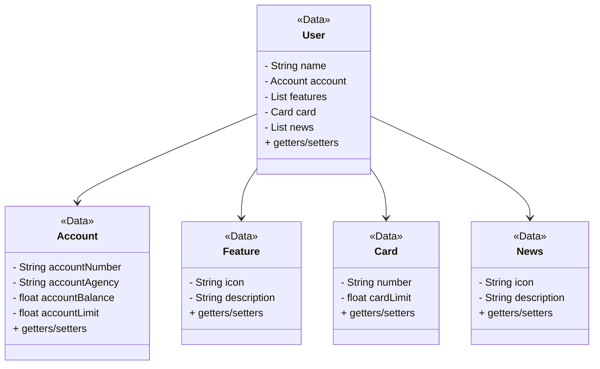

# API-Banco-Satander
Uma API Restful criada com SpringBoot para o BootCamp Santander Java Backend

## Diagrama de Classes

```mermaid
classDiagram
    class User {
        <<Data>>
        - String name
        - Account account
        - List<Feature> features
        - Card card
        - List<News> news
        + getters/setters
    }

    class Account {
        <<Data>>
        - String accountNumber
        - String accountAgency
        - float accountBalance
        - float accountLimit
        + getters/setters
    }

    class Feature {
        <<Data>>
        - String icon
        - String description
        + getters/setters
    }

    class Card {
        <<Data>>
        - String number
        - float cardLimit
        + getters/setters
    }

    class News {
        <<Data>>
        - String icon
        - String description
        + getters/setters
    }

    User --> Account 
    User --> Feature 
    User --> Card 
    User --> News 
```
